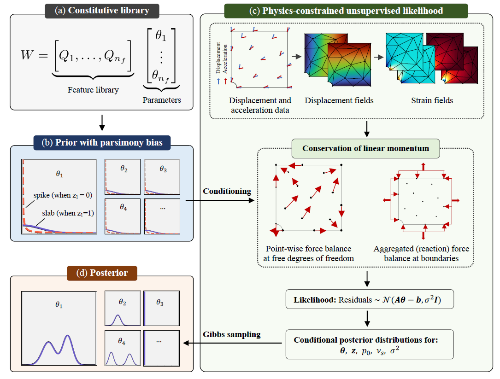

# Bayesian-EUCLID Readme

The Bayesian-EUCLID framework offers a novel way to discover the model of hyperelastic materials
using experimentally available displacement field and reaction force data. An overview of the
procedure adopted in the code can be found in the figure below, which shows a schematic of Bayesian-EUCLID for unsupervised discovery of hyperelastic constitutive laws with uncertainties.
In the figure, (a) A large library of constitutive features (inspired from physics-based and phenomenological models) is chosen for the hyperelastic strain energy density. (b) Sparsity promoting
spike-slab priors are placed on the material parameters to induce bias towards parsimonious constitutive models. (c) The likelihood of the
observed data (consisting of displacement data – including accelerations, if available – and reaction forces) is unsupervised and based on satisfying
the physical constraint of linear momentum balance. Conditioned on the prior, the force residuals are modeled using a Gaussian likelihood. (d)
Using Bayes’ rule and Gibbs sampling, physically admissible, interpretable, and parsimonious constitutive models are discovered in the form of
multi-modal posterior distributions with quantifiable epistemic and aleatoric uncertainties.

Spike slab priors allow for efficient enforcement of parsimony in model selection. Compared to the [previous work](https://www.sciencedirect.com/science/article/pii/S0045782521001894), this EUCLID framework provides significantly faster material discovery (of around 100 times), while using significantly lesser data (1/1000th number of quadrature data points).

The [documentation]() consists of a file-wise explanation of the code and an example file which illustrates the execution of the code to discover the model for a benchmark Arruda-Boyce material. The code and the Finite Element data used to generate the results shown in the [Bayesian-EUCLID paper](https://arxiv.org/abs/2203.07422) are available in the [GitHub repository](). The output of the code is a essentially the Markov chain used to sample the posterior probability distribution of the random variables (including features coefficients `theta`). These feature coefficients are used to construct a plot saved in the `./drivers/plots` folder.
